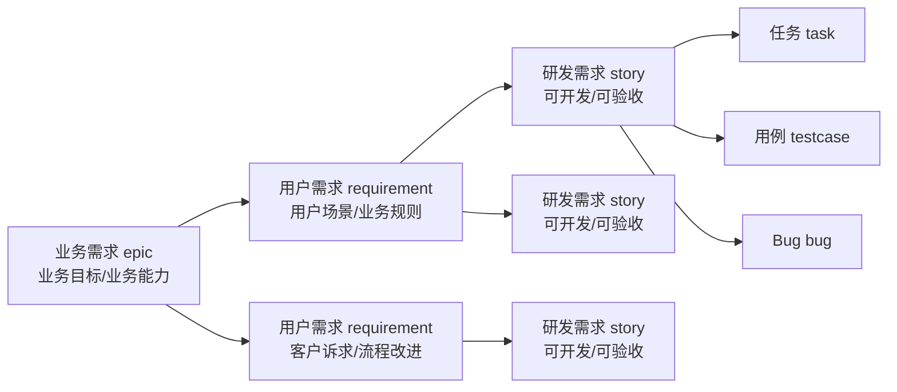
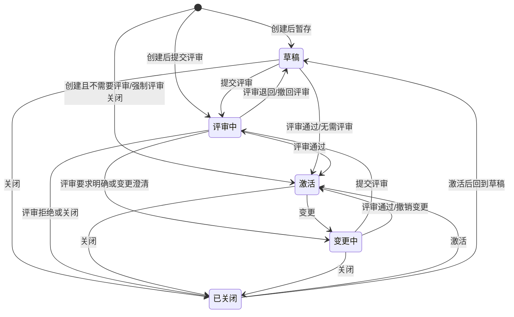
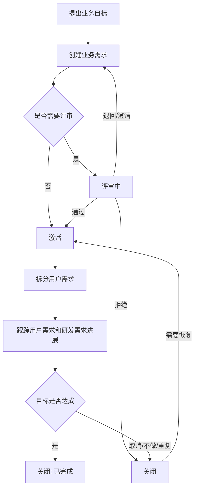
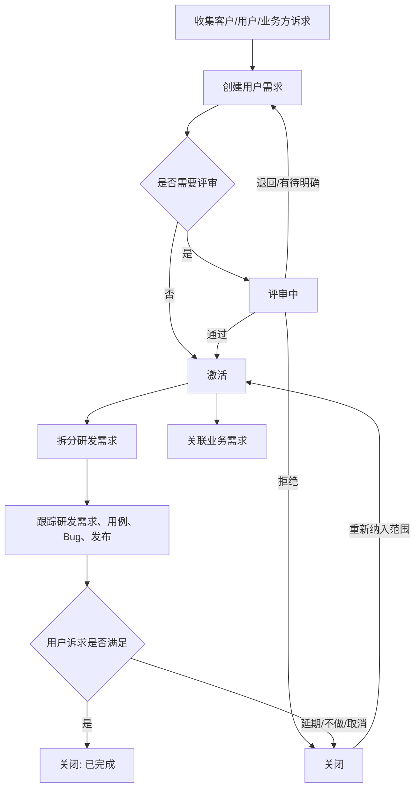
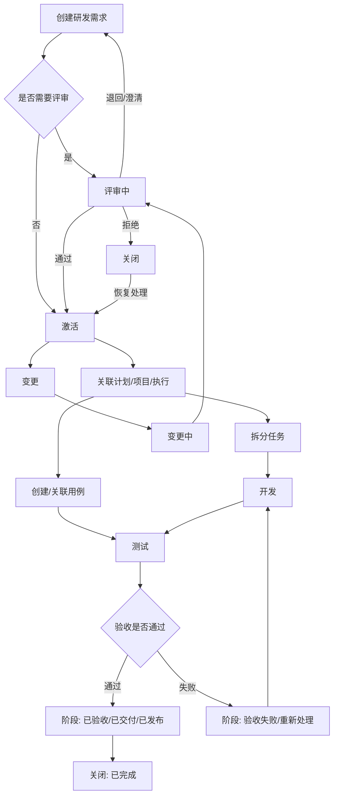
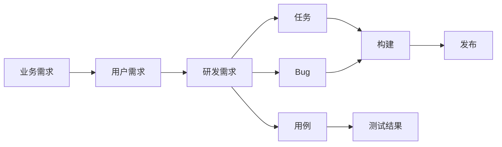

# 业务需求、用户需求、研发需求概念与流转说明

## 1. 概念总览

禅道当前代码中，业务需求、用户需求、研发需求本质上都复用 `zt_story` 这张需求表，通过 `type` 字段区分：

| 中文概念 | 代码类型 | 常见英文/缩写 | 含义 | 默认开关 |
| --- | --- | --- | --- | --- |
| 业务需求 | `epic` | ER / Epic | 面向业务目标、业务能力、业务价值的高层需求。用于描述“为什么做、业务上要达成什么”。 | `enableER` |
| 用户需求 | `requirement` | UR / Requirement | 面向用户场景、客户诉求、业务规则的需求。用于描述“用户/客户需要什么”。 | `URAndSR` |
| 研发需求 | `story` | SR / Story | 面向研发交付的可实现需求。用于描述“研发团队要实现什么、如何验收”。 | 默认启用 |

三者不是三套完全独立的数据模型，而是同一套需求模型在不同抽象层级上的使用方式。代码中 `module/story` 负责主体逻辑，`module/epic`、`module/requirement` 主要通过语言包、菜单、权限、参数等方式复用 story 逻辑。

## 2. 三类需求的边界

### 2.1 业务需求

业务需求描述组织、客户或产品线层面的业务目标，通常粒度最大。

典型问题：

- 业务上为什么需要这件事？
- 这件事支撑什么业务能力或经营目标？
- 成功后应该带来什么价值？

典型内容：

- 业务背景。
- 目标用户或目标客户。
- 业务目标和成功指标。
- 受影响的产品线、业务流程、组织角色。
- 可进一步拆分出的用户需求。

业务需求通常不直接进入开发执行，也不直接拆为任务。它更适合作为需求体系的上层来源和归集对象。

### 2.2 用户需求

用户需求描述用户、客户、运营、市场、客服、业务方等提出的实际诉求，粒度介于业务需求和研发需求之间。

典型问题：

- 谁在什么场景下遇到什么问题？
- 用户希望系统支持什么能力？
- 有哪些业务规则、约束和边界？

典型内容：

- 用户场景。
- 业务规则。
- 期望行为。
- 验收口径。
- 相关业务需求。
- 可进一步拆分出的研发需求。

用户需求用于承接业务目标，并转化为研发团队能消化的研发需求。一个用户需求可以拆分为多个研发需求。

### 2.3 研发需求

研发需求描述研发团队可以设计、开发、测试、交付的最小需求单元，粒度最小。

典型问题：

- 研发团队具体要实现什么？
- 验收标准是什么？
- 是否能拆分任务、创建用例、关联 Bug、进入迭代/执行？

典型内容：

- 需求标题。
- 需求描述。
- 验收标准。
- 优先级。
- 预计工时或规模估算。
- 所属产品、模块、计划、项目/执行。
- 相关任务、用例、Bug、构建、发布。

研发需求是后续项目执行、任务拆分、测试验证、发布交付的核心对象。

## 3. 推荐层级关系

推荐用法如下：

实际使用时可以按项目成熟度裁剪：

- 轻量团队：只使用研发需求。
- 有客户/业务方输入：使用用户需求 + 研发需求。
- 有完整产品规划或大型业务线：使用业务需求 + 用户需求 + 研发需求。

## 4. 状态生命周期

三类需求共用 story 模型的主状态：

| 状态 | 含义 |
| --- | --- |
| 草稿 `draft` | 已记录但尚未进入正式评审或交付流程。 |
| 评审中 `reviewing` | 已提交评审，等待评审人给出意见。 |
| 激活 `active` | 已通过或无需评审，可以进入后续拆分、计划、执行、开发、测试等流程。 |
| 变更中 `changing` | 已激活需求发生内容变更，需要重新澄清或评审。 |
| 已关闭 `closed` | 需求生命周期结束，关闭原因说明为何结束。 |

基础状态流转如下：

说明：

- 创建时是否进入 `draft`、`reviewing` 或 `active`，取决于是否保存草稿、是否需要评审、是否启用强制评审等配置。
- `review` 的结果会影响目标状态：通过进入 `active`，退回/有待明确可能回到 `draft` 或 `changing`，拒绝可能进入 `closed`。
- `activate` 不一定总是回到 `active`。代码中会根据关闭前状态、评审情况等计算激活后的状态。

## 5. 关闭原因

需求关闭时使用 `closedReason` 说明原因：

| 关闭原因 | 含义 |
| --- | --- |
| 已完成 `done` | 需求已经完成并交付或验收。 |
| 已拆分 `subdivided` | 该需求已被拆分为下级需求，不再作为当前粒度继续执行。 |
| 重复 `duplicate` | 与已有需求重复。 |
| 延期 `postponed` | 暂不处理，后续可能重新激活。 |
| 不做 `willnotdo` | 明确放弃。 |
| 已取消 `cancel` | 需求取消。 |
| 设计如此 `bydesign` | 当前系统行为符合设计，不作为需求处理。 |

关闭不是删除。关闭后的需求仍保留历史、关联、统计口径和追溯价值。

## 6. 阶段流转

除主状态外，研发需求还会使用 `stage` 表示交付阶段。阶段更多反映研发交付进度，不等同于主状态。

| 阶段 | 含义 |
| --- | --- |
| 未开始 `wait` | 尚未进入计划或执行。 |
| 已计划 `planned` | 已进入产品计划。 |
| 研发立项 `projected` | 已进入项目。 |
| 设计中 `designing` | 设计进行中。 |
| 设计完毕 `designed` | 设计完成。 |
| 研发中 `developing` | 开发进行中。 |
| 研发完毕 `developed` | 开发完成。 |
| 测试中 `testing` | 测试进行中。 |
| 测试完毕 `tested` | 测试完成。 |
| 已验收 `verified` | 需求验收通过。 |
| 验收失败 `rejected` | 验收未通过。 |
| 交付中 `delivering` | 交付进行中。 |
| 已交付 `delivered` | 已交付。 |
| 已发布 `released` | 已发布。 |
| 已关闭 `closed` | 阶段关闭。 |

阶段通常由关联计划、项目、执行、任务、测试、发布等行为推动。主状态回答“需求是否有效、是否可操作”，阶段回答“交付推进到哪里”。

## 7. 三类需求的典型流转过程

### 7.1 业务需求流转

关键点：

- 业务需求重点跟踪业务目标和下游需求是否覆盖完整。
- 通常不建议直接拆任务。
- 完成标准通常是下游用户需求/研发需求完成，并能证明业务目标已达成。

### 7.2 用户需求流转

关键点：

- 用户需求是业务与研发之间的翻译层。
- 一个用户需求可以拆分为多个研发需求。
- 用户需求关闭前，应检查下游研发需求是否已完成、验收标准是否满足。

### 7.3 研发需求流转

关键点：

- 研发需求是任务、用例、Bug、构建、发布的主要关联对象。
- 只有激活且通常为最小层级的研发需求适合转任务。
- 研发需求发生范围变化后，应走变更和评审，避免执行中的任务、用例、Bug 与需求描述不一致。

## 8. 需求拆分与追踪

推荐追踪链路：

追踪时重点关注：

- 上游需求是否有下游承接。
- 下游研发需求是否覆盖上游验收目标。
- 研发需求是否已拆任务、建用例、关联 Bug。
- 发布内容是否能追溯到研发需求，再追溯到用户需求和业务需求。
- 需求变更后，下游任务、用例、Bug 是否同步评估影响。

## 9. 与任务、Bug、用例的关系

### 任务

任务是研发需求在执行层面的工作分解。任务回答“谁在什么时候做什么工作、预计/消耗/剩余多少工时”。

研发需求可以转任务，任务完成不必然代表需求完成；需求还需要测试、验收、发布等后续动作。

### Bug

Bug 是缺陷对象，可以来源于研发需求、用例、测试结果或线上反馈。Bug 可能反向转为研发需求，表示该问题本质上是新需求或需求变更，而不是单纯缺陷。

### 用例

用例是研发需求验收标准的测试化表达。研发需求应尽量有关联用例，测试结果反映需求是否满足验收口径。

## 10. 实施建议

1. 先统一团队词汇：业务需求、用户需求、研发需求分别对应 `epic`、`requirement`、`story`。
2. 不要把三类需求混用为同一粒度。粒度混乱会导致拆分、排期、统计和验收都不准确。
3. 业务需求关注价值和目标，用户需求关注场景和规则，研发需求关注实现和验收。
4. 研发需求进入执行前，应尽量达到可开发、可测试、可验收。
5. 变更必须走显式流转，尤其是已进入执行的研发需求。
6. 关闭需求时必须填写真实关闭原因，便于后续统计和复盘。
7. 项目视角统计时，应区分范围进度和工时进度：需求数量/阶段反映范围，任务和工时反映执行投入。

